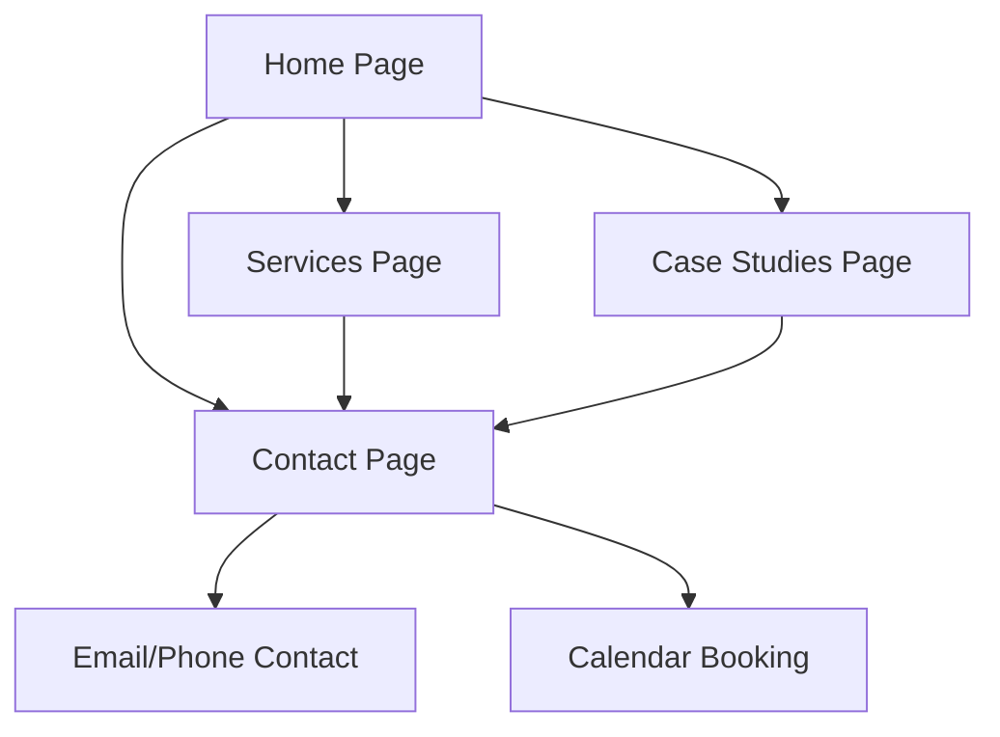

## 1. Product Overview
A professional, eye-catching portfolio website for a Google and Social Ads Manager to showcase expertise in digital advertising. The platform demonstrates campaign management skills, showcases successful case studies with metrics, and provides a streamlined way for potential clients to make contact.

Target market: Small to medium businesses seeking professional digital advertising services, marketing agencies looking for freelance ad managers, and enterprises requiring specialized ad campaign expertise.

## 2. Core Features

### 2.1 User Roles
This is a public portfolio website with no user authentication required. All visitors have read-only access to browse the entire portfolio content.

### 2.2 Feature Module
The portfolio consists of the following main pages:
1. **Home page**: Hero section with compelling headline, professional introduction, and key value propositions.
2. **Services page**: Detailed showcase of Google Ads and Social Media advertising services with pricing tiers.
3. **Case Studies page**: Portfolio of successful campaigns with metrics, results, and client testimonials.
4. **Contact page**: Professional contact form with multiple contact methods and quick inquiry options.

### 2.3 Page Details
| Page Name | Module Name | Feature description |
|-----------|-------------|---------------------|
| Home page | Hero section | Display compelling headline with animated text, professional headshot, and key value proposition with call-to-action buttons. |
| Home page | About section | Brief professional background, certifications, years of experience, and unique selling points in digital advertising. |
| Home page | Services preview | Quick overview of main service categories with icons and brief descriptions linking to full services page. |
| Home page | Featured case studies | Showcase 2-3 best performing campaigns with key metrics and client logos in a carousel format. |
| Home page | Testimonials | Rotating client testimonials with star ratings, client names, and company names. |
| Home page | Contact CTA | Prominent contact section with email, phone, and consultation booking button. |
| Services page | Google Ads services | Detailed service breakdown including Search Ads, Display Ads, Shopping Ads, YouTube Ads with pricing and deliverables. |
| Services page | Social Ads services | Facebook, Instagram, LinkedIn, and TikTok advertising services with platform-specific expertise highlights. |
| Services page | Service packages | Tiered pricing structure (Basic, Professional, Enterprise) with feature comparison table. |
| Case Studies page | Campaign gallery | Filterable portfolio grid showing campaign thumbnails, client names, platforms used, and key results. |
| Case Studies page | Detailed case study | Individual campaign pages with challenge, solution, implementation, results (CTR, ROI, conversion rates), and client testimonial. |
| Contact page | Contact form | Professional form with name, email, company, budget range, service interest dropdown, and message field. |
| Contact page | Quick contact | Direct email, phone number, LinkedIn profile, and calendar booking integration. |

## 3. Core Process
The visitor journey flows seamlessly from discovery to contact. Users land on the homepage where they're immediately presented with the value proposition through the hero section. They can then explore services to understand offerings, review case studies for credibility, and easily reach out through multiple contact methods.

## 4. User Interface Design

### 4.1 Design Style
- **Primary colors**: Professional blue (#2563eb) with accent orange (#f97316) for CTAs
- **Secondary colors**: Clean whites (#ffffff) and light grays (#f8fafc) for backgrounds
- **Button style**: Modern rounded corners with hover animations and shadow effects
- **Typography**: Inter font family with hierarchy: H1 48px, H2 36px, H3 24px, Body 16px
- **Layout style**: Card-based design with generous whitespace, top navigation with sticky header
- **Icons**: Professional line icons from Lucide React with consistent stroke width
- **Animations**: Smooth scroll reveals, fade-in effects, and subtle hover animations

### 4.2 Page Design Overview
| Page Name | Module Name | UI Elements |
|-----------|-------------|-------------|
| Home page | Hero section | Full-width gradient background, animated headline text, professional headshot with circular crop, dual CTA buttons with hover effects, trust badges below fold. |
| Services page | Service cards | 3-column responsive grid, card hover lift effect, icon-based headers, bullet point features, pricing badges, and CTA buttons. |
| Case Studies page | Portfolio grid | Masonry layout with hover overlay showing key metrics, filter buttons for platform types, load more functionality, and detailed modal views. |
| Contact page | Form layout | Two-column layout with form on left and contact info on right, input field animations, form validation indicators, and success message display. |

### 4.3 Responsiveness
Desktop-first design approach with mobile optimization. Breakpoints: Desktop (1200px+), Tablet (768px-1199px), Mobile (320px-767px). Touch-friendly navigation with hamburger menu on mobile, optimized tap targets, and swipe-enabled carousels for case studies.