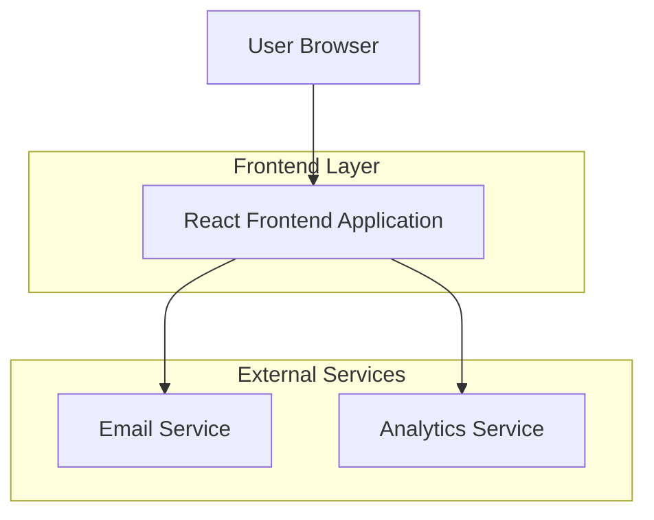

## 1. Architecture design



## 2. Technology Description
- Frontend: React@18 + tailwindcss@3 + vite
- Initialization Tool: vite-init
- Backend: None (Static portfolio with email integration)
- Email Service: EmailJS or Formspree for contact form handling
- Analytics: Google Analytics 4 for visitor tracking

## 3. Route definitions
| Route | Purpose |
|-------|---------|
| / | Home page with hero section and overview |
| /services | Services page showcasing Google and Social Ads offerings |
| /case-studies | Portfolio of successful advertising campaigns |
| /contact | Contact page with form and direct contact methods |

## 4. Component Architecture

### 4.1 Core Components
- **Header**: Sticky navigation with smooth scroll, mobile hamburger menu
- **HeroSection**: Animated headline, CTA buttons, professional introduction
- **ServiceCard**: Reusable card for service offerings with hover effects
- **CaseStudyCard**: Portfolio item with metrics overlay and modal expansion
- **TestimonialCarousel**: Rotating client testimonials with auto-play
- **ContactForm**: Validated form with success/error states
- **Footer**: Professional footer with social links and quick navigation

### 4.2 State Management
- React Context for global state (theme, language preferences)
- Local component state for forms, modals, and interactive elements
- No external state management library needed for portfolio scope

### 4.3 Performance Optimizations
- Lazy loading for images and case study content
- Code splitting for route-based components
- Image optimization with WebP format and responsive sizing
- Preload critical fonts and above-fold content
- Implement intersection observer for scroll animations

## 5. Third-party Integrations

### 5.1 Email Service Integration
```javascript
// EmailJS configuration for contact form
emailjs.init("YOUR_PUBLIC_KEY");

// Form submission handler
const handleSubmit = async (formData) => {
  await emailjs.send("service_id", "template_id", formData);
};
```

### 5.2 Analytics Implementation
- Google Analytics 4 for visitor behavior tracking
- Event tracking for CTA clicks and form submissions
- Conversion tracking for contact form completions

## 6. Build and Deployment

### 6.1 Build Configuration
- Vite for fast development and optimized production builds
- PostCSS with Tailwind CSS for utility-first styling
- Autoprefixer for cross-browser compatibility
- CSS minification and tree shaking enabled

### 6.2 Deployment Strategy
- Static site hosting on Vercel or Netlify
- CDN integration for global performance
- Custom domain with SSL certificate
- Environment variables for API keys and configurations

## 7. Development Guidelines

### 7.1 Code Structure
```
src/
├── components/
│   ├── common/
│   ├── sections/
│   └── ui/
├── pages/
├── hooks/
├── utils/
├── assets/
│   ├── images/
│   └── icons/
└── styles/
    └── globals.css
```

### 7.2 Best Practices
- Component-based architecture with single responsibility principle
- Consistent naming conventions (PascalCase for components, camelCase for functions)
- TypeScript for type safety (optional but recommended)
- ESLint and Prettier for code quality and formatting
- Mobile-first responsive design approach